<!-- 1. Git Configuration Commands-->
<!-- git config--global user.name-->
command name :git config --global user.name
syntax: git config --global user.name "username"
purpose:
this sets the name that will appear in your commits
example:
 git config --global user.name "deekshithamatcha"
Screenshot proof:
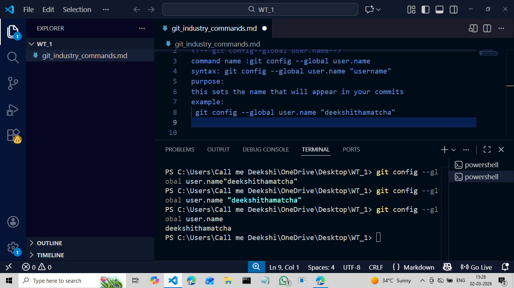

<!-- git config--global user.email-->
command name: git config--global user.email
syntax : git config--global user.email "useremail"
purpose:
this sets the email that will be associated with your commits
example:
git config--global user.email "n221146@rguktn.ac.in"
Screenshot proof:
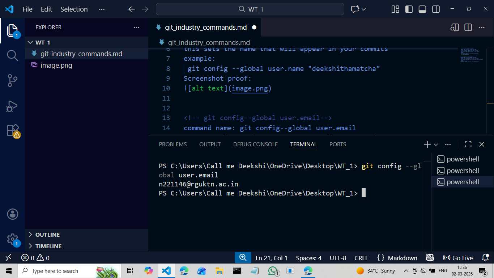

<!--git config --list-->
command name: git config --list
syntax : git config --list
purpose:
displays all the current git configuration settings
example:
user.name=deekshithamatcha
user.email=n221146@rguktn.ac.in
core.editor=code
Screenshot proof:
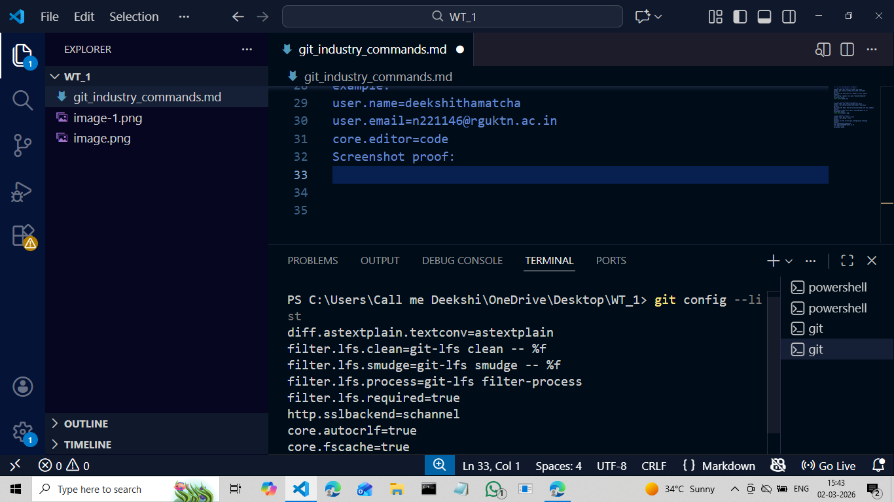

<!-- git config --unset-->
command name: git config --unset
syntax: git config --unset <key>
purpose:
this command is used to delete/remove a git configuration setting
example:
git config --global --unset user.name
Screenshot proof:
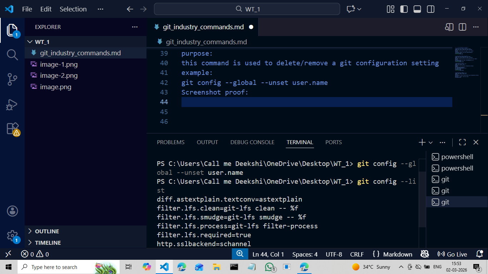

<!--2.repository setup commands-->
<!-- git init-->
command:git init
syntax: git init [repository-name]
purpose:
used to create a new git repository in your project folder
example:
git init
Screenshot purpose:
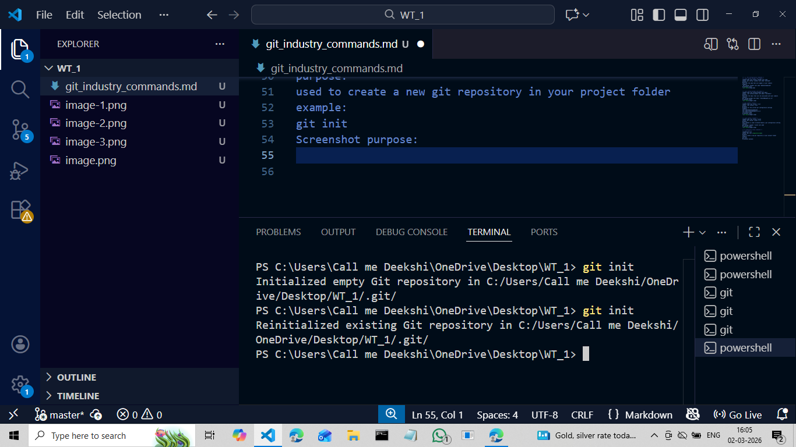

<!-- git clone-->
command name :
git clone
syntax:
git clone <repository-url> [folder-name]
purpose:
this is used to download an existing repository from a remote server to your local computer
example:
git clone  
screenshot proof:
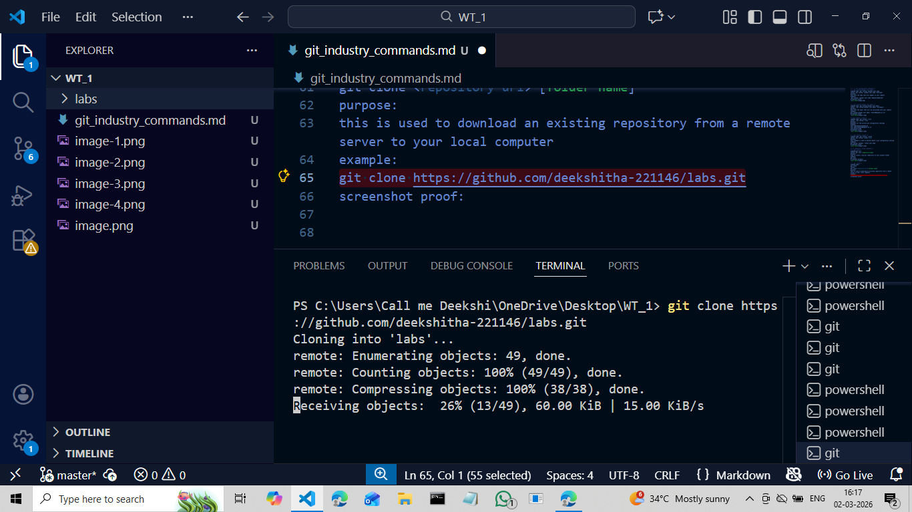

<!--git clone --branch-->
command name: git clone --branch
syntax:
git clone -- branch<branch-name><repository-URL>
purpose:
this command is used to clone only a specific branch from a remote repository instead of downloading all branches
example:
git clone --branch main https://github.com/deekshitha-221146/labs.git
screenshot proof:
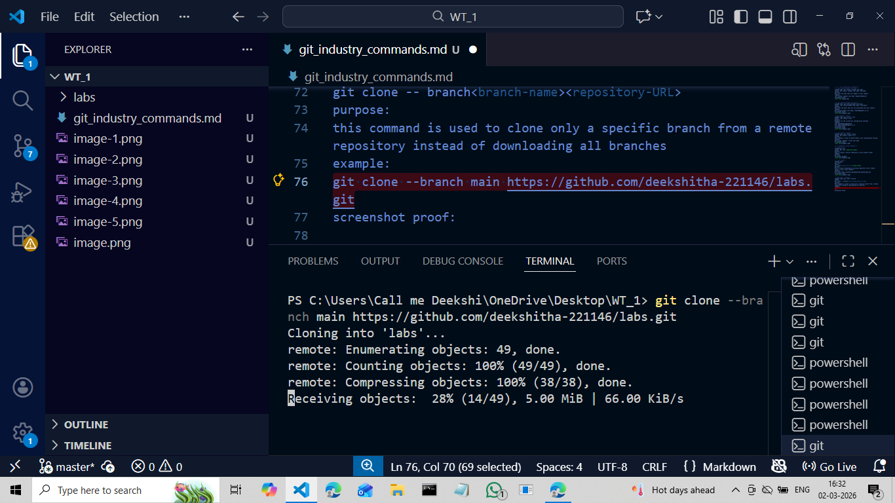

<!--git clone --depth-->
command name: git clone --depth
syntax :
git clone --depth <number> <repository-URL>
purpose:
this is used to limit how much commit history git downloads
example:
git clone --depth 1 https://github.com/deekshitha-221146/DSP.git
screenshot proof:
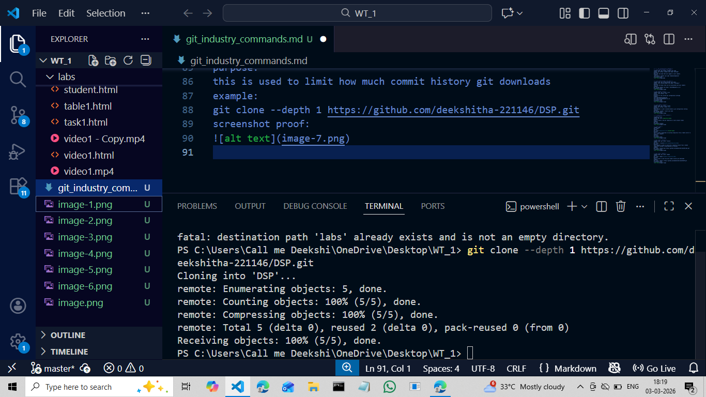

<!-- repository status and inspection-->
<!--git status-->
command name: git status
syntax:
git status
purpose: it shows-current branch,modified files,staged files,untracked files
example: git status
screenshot proof:
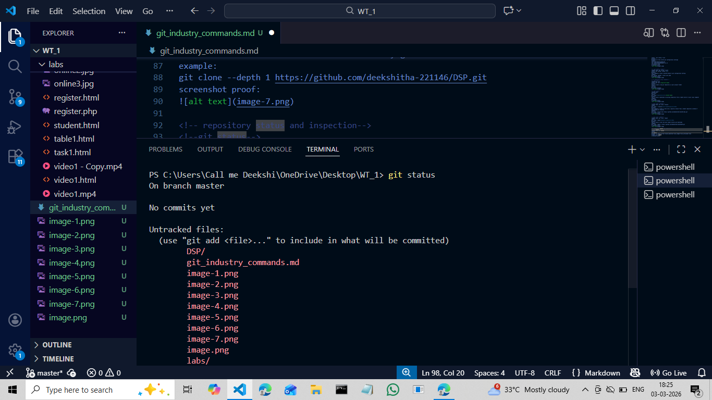

<!-- git log-->
command name: git log
syntax:git log
purpose:shows full commit history
example: git log
screenshot proof:
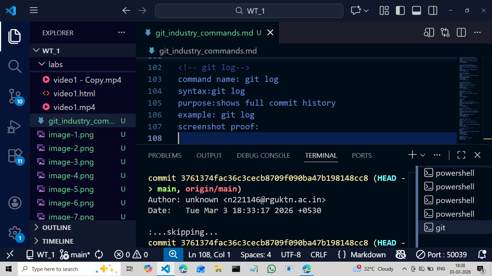

<!--git log --oneline-->
command name: git log --oneline
syntax: git log --oneline
purpose: shows commit history in one-line format
example: git log --oneline
screenshot proof:
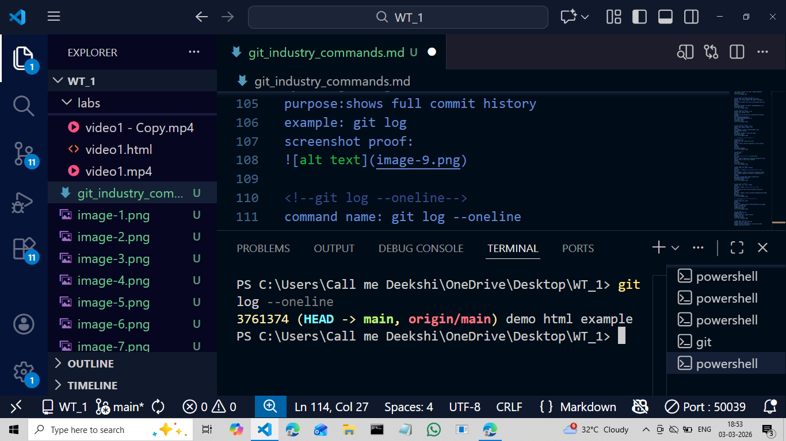

<!-- git log --graph-->
command name:git log --graph
syntax: git log --graph --oneline --all
purpose: shows commit history in graphical branch structure
example: git log --graph --oneline --all
screenshot proof:
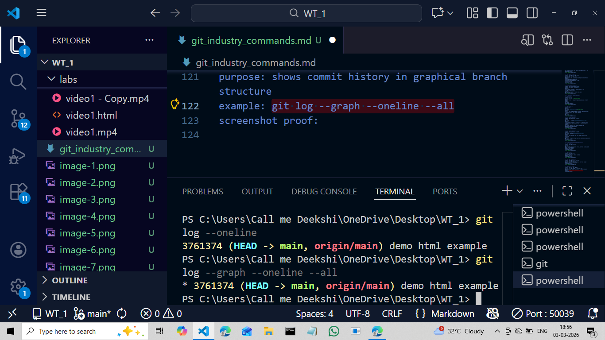

<!-- git show-->
command name: git show
syntax: git show <commit-id>
purpose: shows details of a specific commit
example: git show 4f5g6h7
screenshot proof:
